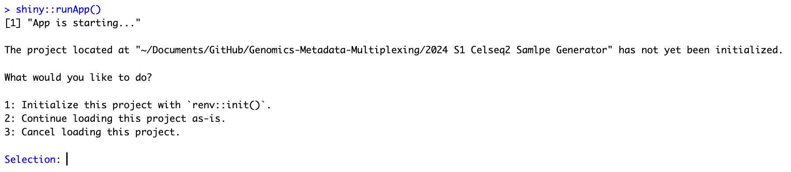

# Celseq2 FCS Operation Dashboard

# How to Run the Shiny R Application

This guide provides step-by-step instructions on how to set up and run the Shiny R application for the Genomics Metadata Multiplexing project, specifically the "2024 S1 Celseq2 Sample Generator" module. This application is designed to facilitate the processing and analysis of genomics metadata, providing an interactive user interface for various operations.

## Prerequisites

Before running the application, ensure you have the following installed:

- **R**: The latest version of R is recommended. You can download it from [CRAN](https://cran.r-project.org/).
- **RStudio**: While not strictly necessary, RStudio provides a convenient and user-friendly environment for running R scripts and applications. Download it from [RStudio's website](https://www.rstudio.com/products/rstudio/download/).

## Initial Setup

1. **Clone the GitHub Repository**: First, clone the repository containing the Shiny application to your local machine. 
2. **Navigate to the Project Directory**: Change your working directory to the "2024 S1 Celseq2 Sample Generator" within the cloned repository:
3. **Install R and RStudio**: If not already installed, download and install R and RStudio from their respective websites.

## Project Dependencies

This project uses the `renv` package for dependency management to ensure reproducibility.

1. **Open the Project in RStudio**: Open RStudio, and then open the project by navigating to `File > Open Project`, selecting the `.Rproj` file within the "2024 S1 Celseq2 Sample Generator" directory.

2. **Run `app.R` use `runApp()` command** 

```R
shiny::runApp()
```

For first time running, you may need to install the required packages. You will see the following prompt:



Please select number **2** and continue, then the application will ask you install all dependencies, please select **Yes/Y**.

All the required packages will be installed automatically and the application will be launched in your default web browser at http://127.0.0.1:4341.
